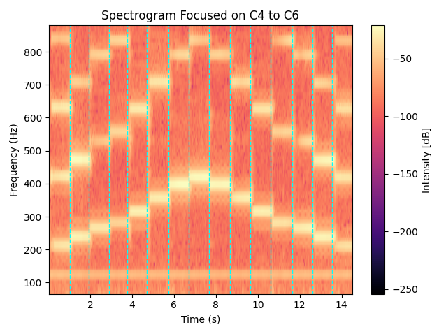

# 🎵 Music Scale Evenness Analyzer

This project analyzes the **evenness and timing consistency** of a musical scale using audio signal processing techniques. It detects note onsets from an audio recording (such as a scale played on a piano or another instrument), computes the spacing between them, and calculates an **evenness score** between 0 and 100.

---

## 🧠 Motivation

Musicians often aim to play scales with **evenly timed notes**. This tool provides feedback on **rhythmic consistency**, helping assess and improve scale practice with real-time data and visualizations.

---

## 📂 Dataset

- Uses a local `.wav` audio file of a musical scale (e.g., `scales4.wav`)
- Audio should contain **one scale** with **clear, separate notes**
- Sample rate and format handled automatically by `librosa`

---

## 🛠️ Features

- **Onset detection** using energy envelope
- **Spectrogram** with vertical lines marking note onsets
- **Inter-onset interval (IOI)** analysis
- **Evenness Score** (0 = irregular, 100 = perfectly even)
- Focused frequency range from **C2 to A5**
- Visual and quantitative feedback

---

## 🔧 Technologies Used

- Python
- [Librosa](https://librosa.org/) – audio analysis
- Matplotlib – visualizations
- NumPy & SciPy – math + signal processing

---

## 🖼️ Sample Visualization

The program generates a spectrogram with vertical lines marking each detected note:

---
